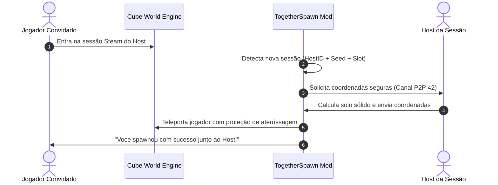

# 🌐 CubeForge TogetherSpawn

<div align="center">


**Mod de alta performance para Cube World (Steam x64) que corrige o sistema de spawn multiplayer, otimiza a estabilidade P2P e permite co-op cooperativo imediato entre amigos.**

[Funcionalidades](#-funcionalidades-principais) •
[Instalação](#-instalação-rápida) •
[Comandos](#-comandos-in-game) •
[Configuração](#%EF%B8%8F-configurações) •
[Compilação](#%EF%B8%8F-compilação-e-desenvolvimento) •
[Documentação Completa](#-documentação-técnica)

</div>

---

## 🎯 O Problema & A Solução

No **Cube World** original da Steam, quando novos jogadores entram em uma sessão através do Steam Friends / P2P, o jogo frequentemente gera o personagem em coordenadas de início de *singleplayer*, situadas a centenas de quilômetros ou dezenas de regiões de distância do Host. Isso obriga os jogadores a caminhar por horas para se encontrarem.

O **CubeForge TogetherSpawn** resolve essa limitação de forma nativa e inteligente:



---

## ✨ Funcionalidades Principais

- 📍 **Spawn Inicial Inteligente Próximo ao Host**: Ao conectar pela primeira vez no mundo de um amigo, o mod calcula uma posição de terreno sólido em raio radial de 4 blocos e posiciona o jogador sem risco de sufocamento ou queda.
- 💾 **Histórico Persistente de Sessões**: Salva as sessões já visitadas em `%APPDATA%\CubeForge\TogetherSpawn\together_spawn_config.json`. Reconexões futuras preservam a posição onde o jogador parou, evitando teleportes indesejados.
- 🛡️ **Proteção de Aterrissagem (Anti-Queda / Anti-Mob)**: Concede 5 segundos de invulnerabilidade com $+999.999$ de armadura e resistência elemental pós-teleporte.
- 🚀 **Otimizador de Rede P2P Steamworks**: Auto-aceitação de requisições de conexão (`OnP2PRequest`) no canal P2P dedicado `42`, prevenindo desyncs, desconexões e telas de carregamento infinitas.
- 🗺️ **Desbloqueio de Regiões de Spawn**: Aplica patch no motor para remover restrições regionais de spawn no multiplayer.
- 👥 **Comandos e Teleporte Entre Amigos**: Comandos in-game com cooldown configurável para teleporte voluntário até o Host ou amigos distantes (`/tp <amigo>`, `/tphost`).
- 🚩 **Ponto de Spawn de Time (`/setteamspawn`)**: O Host pode definir uma base ou local sagrado como o ponto oficial de entrada para todos os jogadores.

---

## 📦 Instalação Rápida

### Pré-requisitos
- Jogo **Cube World** (versão Steam x64).
- **CubeForge Loader** (ou **CubeModLoader**) instalado na raiz do jogo.

### Passo a Passo
1. Baixe o arquivo `TogetherSpawn.dll` da [seção de Releases](../../releases) ou compile o projeto.
2. Copie `TogetherSpawn.dll` para a pasta `Mods/` dentro do diretório do Cube World:
   ```
   Cube World/
   ├── CubeWorld.exe
   ├── CubeForgeLoader.dll
   └── Mods/
       └── TogetherSpawn.dll
   ```
3. Inicie o jogo normalmente pela Steam. O mod será carregado automaticamente.

---

## 💬 Comandos In-Game

Pressione **`Enter`** para abrir o chat do jogo e digite:

| Comando | Descrição | Permissão |
| :--- | :--- | :--- |
| `/together status` | Exibe status da sessão, Seed, Host SteamID e lista de jogadores com distâncias. | Todos |
| `/together sync` | Força a sincronização e teleporte para próximo do Host via P2P. | Client |
| `/together reset` | Reseta a marcação de "já spawnado" para a sessão atual. | Todos |
| `/together radius <N>` | Ajusta o raio de spawn em blocos (ex: `/together radius 5`). | Todos |
| `/tphost` ou `/spawn` | Teleporta voluntariamente até o Host (sujeito a cooldown). | Client |
| `/tp <nome_do_jogador>` | Teleporta até um amigo conectado na mesma sessão. | Todos |
| `/setteamspawn` | *(Host)* Define a posição atual como ponto oficial de spawn do time. | Host |
| `[F6]` | Abre/fecha o menu de configurações rápidas overlay. | Todos |

> Para mais detalhes sobre regras e mensagens, consulte o [📖 Guia de Comandos](docs/COMMANDS.md).

---

## ⚙️ Configurações

O arquivo de configuração é gerado automaticamente em:
```
%APPDATA%\CubeForge\TogetherSpawn\together_spawn_config.json
```

```json
{
  "auto_spawn_near_host": true,
  "spawn_radius_blocks": 4.0,
  "auto_accept_p2p": true,
  "invulnerability_seconds": 5.0,
  "allow_teleport_commands": true,
  "teleport_cooldown_seconds": 10,
  "spawned_sessions": [
    "76561198012345678_26879_0"
  ]
}
```

> Para explicação detalhada de cada parâmetro, consulte o [📖 Guia de Configuração](docs/CONFIGURATION.md).

---

## 🛠️ Compilação e Desenvolvimento

### Pré-requisitos
- **Visual Studio 2022** (MSVC v143 x64) com suporte a **C++20**
- **CMake 3.25+** e **Ninja Build**
- **CubeForge SDK (CWSDK)** (resolvida automaticamente via pasta local ou GitHub)

### Compilando via PowerShell
```powershell
# Compilação padrão em modo Release x64
.\build.ps1 -BuildType Release

# Compilação em modo Debug com diagnósticos
.\build.ps1 -BuildType Debug

# Compilação e instalação direta no Cube World
.\build.ps1 -BuildType Release -InstallPath "C:\Program Files (x86)\Steam\steamapps\common\Cube World"
```

A DLL de saída será gerada em `dist/Mods/TogetherSpawn.dll`.

> Para o fluxo completo de contribuição, padrões de código e PRs, veja o [📖 Guia de Contribuição](docs/CONTRIBUTING.md).

---

## 📚 Documentação Técnica

| Documento | Descrição |
| :--- | :--- |
| [🏗️ Arquitetura Técnica](docs/ARCHITECTURE.md) | Detalhamento do design em camadas (FSD), ciclo de vida de hooks, algoritmo de terreno e protocolo P2P. |
| [💬 Referência de Comandos](docs/COMMANDS.md) | Lista completa de comandos, parâmetros, mensagens de erro e permissões. |
| [⚙️ Referência de Configurações](docs/CONFIGURATION.md) | Documentação de cada campo JSON, chaves de sessão e persistência thread-safe. |
| [🤝 Guia de Contribuição](docs/CONTRIBUTING.md) | Ambiente de desenvolvimento, boas práticas em C++20, testes e fluxo de PRs. |
| [🔧 Resolução de Problemas](docs/guides/troubleshooting.md) | Diagnósticos e soluções para problemas comuns de conexão, carregamento e colisão. |

---

## 📜 Licença

Distribuído sob a licença **MIT**. Consulte o arquivo [LICENSE](LICENSE) para mais detalhes.
