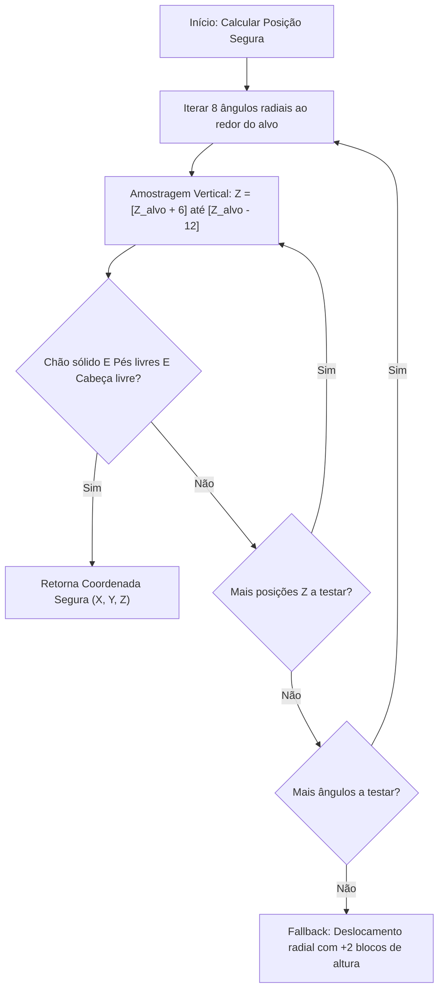
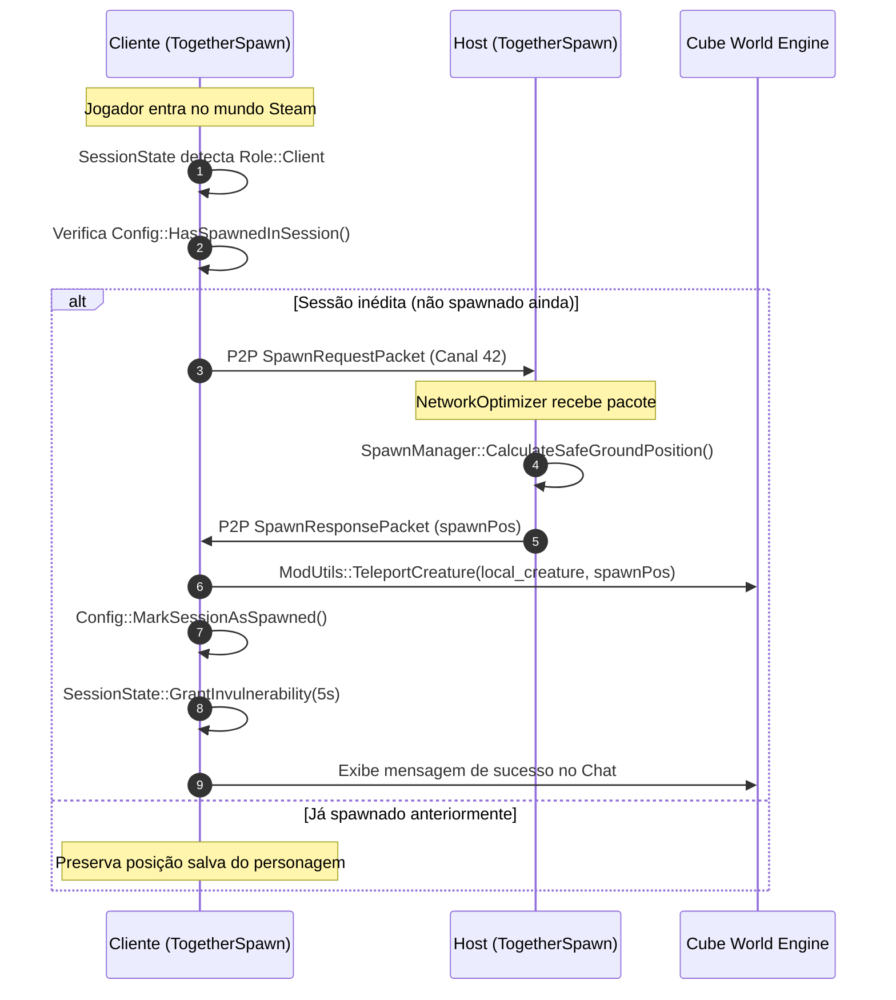
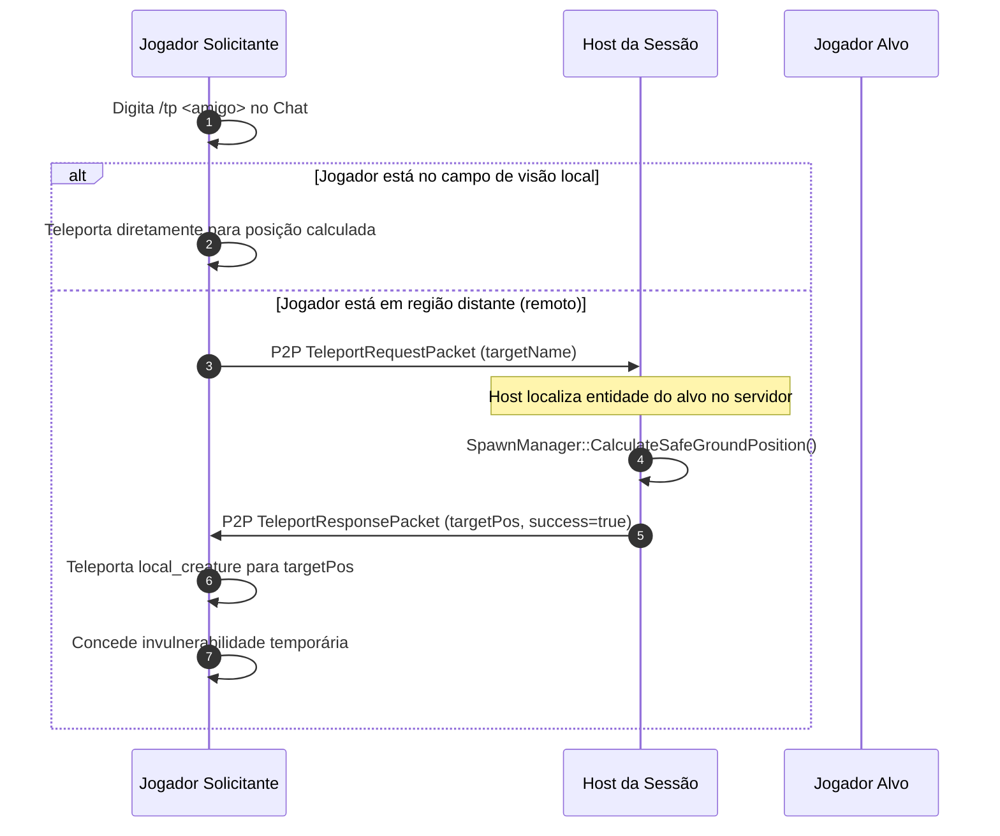

# 🏗️ Arquitetura Técnica - CubeForge TogetherSpawn

Este documento descreve detalhadamente o design arquitetural, o ciclo de vida, o protocolo de rede P2P e os algoritmos internos do mod **TogetherSpawn** para Cube World (versão Steam x64).

---

## 📑 Sumário
- [1. Visão Geral e Princípios de Design](#1-visão-geral-e-princípios-de-design)
- [2. Estrutura de Camadas (Feature-Sliced Design)](#2-estrutura-de-camadas-feature-sliced-design)
- [3. Ciclo de Vida e Hooks do Jogo](#3-ciclo-de-vida-e-hooks-do-jogo)
- [4. Subsistema de Spawn e Algoritmo de Terreno Seguro](#4-subsistema-de-spawn-e-algoritmo-de-terreno-seguro)
- [5. Subsistema de Rede e Protocolo P2P Customizado](#5-subsistema-de-rede-e-protocolo-p2p-customizado)
- [6. Subsistema de Estado e Configuração Persistente](#6-subsistema-de-estado-e-configuração-persistente)
- [7. Subsistema de Comandos e Interface](#7-subsistema-de-comandos-e-interface)
- [8. Diagramas de Sequência](#8-diagramas-de-sequência)
- [9. Modelo de Threading e Segurança de Memória](#9-modelo-de-threading-e-segurança-de-memória)

---

## 1. Visão Geral e Princípios de Design

O **TogetherSpawn** foi desenvolvido em **C++20 (MSVC x64)** com foco em modularidade, estabilidade de runtime e desacoplamento de responsabilidades. Ele utiliza a **CubeForge SDK (CWSDK)** para interagir com as estruturas de memória do executável do Cube World.

### Princípios Chave:
- **Clean Architecture & Feature-Sliced Design (FSD)**: Separação clara entre núcleo (`core`), utilitários (`utils`) e módulos de domínio/funcionalidade (`features/spawn`, `features/network`, `features/commands`, `features/ui`).
- **Resiliência P2P**: Canal de comunicação customizado no Steamworks P2P que não interfere no tráfego nativo do jogo.
- **Segurança de Spawn**: Algoritmo de raymarching/amostragem volumétrica para evitar spawn dentro de blocos sólidos (sufocamento) ou no vazio.
- **Thread Safety**: Proteção de estruturas de configuração compartilhadas via `std::mutex`.

---

## 2. Estrutura de Camadas (Feature-Sliced Design)

A base de código está organizada sob a raiz `src/`:

```
src/
├── main.cpp                     # Entry point do mod (MakeMod DLL export)
├── TogetherSpawnMod.h/.cpp       # Classe principal e despacho de hooks
│
├── core/                        # Estado global e persistência
│   ├── Config.h/.cpp            # Gerenciamento de configurações e histórico JSON
│   └── SessionState.h/.cpp      # Papel da sessão (Host/Client), cooldowns, invulnerabilidade
│
├── features/                    # Módulos de domínio
│   ├── spawn/                   # Lógica de cálculo de terreno e spawn
│   │   ├── SpawnManager.h/.cpp
│   │
│   ├── network/                 # Comunicação Steamworks P2P
│   │   ├── NetworkOptimizer.h/.cpp
│   │   └── NetworkProtocol.h    # Definição binária dos pacotes P2P
│   │
│   ├── commands/                # Processamento de comandos no chat
│   │   ├── CommandManager.h/.cpp
│   │
│   └── ui/                      # Captura de teclado e interface ImGui
│       ├── OverlayUI.h/.cpp
│
└── utils/                       # Utilitários compartilhados
    ├── Logger.h                 # Logging formatado
    ├── MathUtils.h              # Conversões de coordenadas (Dots <-> Blocks)
    └── ModUtils.h/.cpp          # Operações com entidades, chat colorido e teleporte
```

---

## 3. Ciclo de Vida e Hooks do Jogo

O mod herda de `GenericMod` (da CWSDK) e registra prioridades específicas para seus callbacks:

| Hook / Callback | Prioridade | Responsabilidade |
| :--- | :--- | :--- |
| `Initialize()` | - | Carrega configurações (`Config::Load`), desativa restrição de regiões de spawn no motor. |
| `OnGameTick(game)` | `NormalPriority` | Atualiza o estado da sessão, processa pacotes P2P pendentes e executa verificações de spawn. |
| `OnChat(message)` | `HighPriority` | Intercepta comandos iniciados por `/` antes que sejam enviados ao servidor/chat público. |
| `OnP2PRequest(steamID)` | `VeryHighPriority` | Auto-aceita solicitações de sessão P2P via Steamworks para mitigar desconexões. |
| `OnCreatureArmorCalculated` | `NormalPriority` | Injeta armadura temporária durante a janela de proteção pós-spawn/teleporte. |
| `OnCreatureResistanceCalculated` | `NormalPriority` | Injeta resistência mágica temporária durante a janela de proteção pós-spawn/teleporte. |
| `OnGetKeyboardState(diKeys)` | `NormalPriority` | Monitora teclas de atalho (ex: `F6` para alternar menu). |
| `OnDrawImGui()` | `NormalPriority` | Renderiza janelas de interface gráfica overlay quando ativadas. |

---

## 4. Subsistema de Spawn e Algoritmo de Terreno Seguro

### O Problema do Spawn Nativo
No Cube World original, conexões de clientes via Steam Friends recebem do jogo coordenadas de spawn de novo personagem localizadas em biomas padrão de singleplayer. Isso frequentemente coloca jogadores a mais de 100.000 blocos de distância do Host.

### Algoritmo de Cálculo de Posição Segura (`CalculateSafeGroundPosition`)
Para evitar que o jogador teleporte para o ar ou dentro de paredes rochosas, o `SpawnManager` realiza uma verificação radial em 8 ângulos ao redor da entidade alvo:

1. **Amostragem em Anel**: Calcula 8 candidatos em raio configurável (padrão: 4 blocos):
   $$\theta_i = i \times \frac{2\pi}{8}, \quad \Delta x = \cos(\theta_i) \times R, \quad \Delta y = \sin(\theta_i) \times R$$
2. **Varredura Vertical de Colisão**:
   Para cada ponto $(x, y)$, testa o eixo $Z$ de $+6$ blocos até $-12$ blocos em relação ao alvo:
   - `groundBlock = GetBlockInterpolated(x, y, z - 1)` (deve ser sólido, não-água, não-lava).
   - `feetBlock   = GetBlockInterpolated(x, y, z)` (deve ser ar/desobstruído).
   - `headBlock   = GetBlockInterpolated(x, y, z + 1)` (deve ser ar/desobstruído).
3. **Seleção e Conversão**:
   O primeiro candidato válido é convertido de coordenadas de blocos para *World Dots* ($1 \text{ bloco} = 65536 \text{ dots}$):
   $$\text{WorldPos} = \text{BlockPos} \times \text{DOTS\_PER\_BLOCK} + \frac{\text{DOTS\_PER\_BLOCK}}{2}$$
4. **Fallback Seguro**: Se nenhum ponto ideal for encontrado, aplica o deslocamento radial plano a $+2$ blocos acima da posição do alvo.



---

## 5. Subsistema de Rede e Protocolo P2P Customizado

O TogetherSpawn cria um canal de controle dedicado no Steamworks P2P:
- **Canal P2P**: `42` (`TOGETHER_SPAWN_P2P_CHANNEL`)
- **Magic Number**: `0x43575453` (`CWTS` em ASCII)
- **Protocol Version**: `1`
- **Estruturas de Dados**: Alinhadas em 1 byte (`#pragma pack(push, 1)`).

### Pacotes Definidos (`NetworkProtocol.h`)

1. **`SpawnRequestPacket` (Type 1)**:
   Enviado pelo cliente ao Host na primeira conexão. Contém `clientSteamID`, `worldSeed`, `characterSlot` e `characterName`.
2. **`SpawnResponsePacket` (Type 2)**:
   Enviado pelo Host ao cliente contendo as coordenadas calculadas (`LongVector3 spawnPos`) e flag de sucesso.
3. **`TeleportRequestPacket` (Type 3)**:
   Enviado por um jogador para solicitar a localização de um jogador remoto ou do Host.
4. **`TeleportResponsePacket` (Type 4)**:
   Resposta do Host com a posição atualizada do jogador consultado (`LongVector3 targetPos`).

---

## 6. Subsistema de Estado e Configuração Persistente

### Rastreamento de Sessões
Para que o teleporte automático ocorra apenas na **primeira vez** que um personagem entra naquele mundo daquele Host específico:
- É gerada uma chave de sessão única:
  $$\text{SessionKey} = \text{HostSteamID} + \text{"\_"} + \text{WorldSeed} + \text{"\_"} + \text{CharacterSlot}$$
- As chaves são salvas no array `spawned_sessions` em `%APPDATA%\CubeForge\TogetherSpawn\together_spawn_config.json`.
- Ao reconectar, o mod identifica a chave e preserva a posição onde o jogador parou.

### Proteção de Aterrissagem
Durante os $N$ segundos configurados após um teleporte (`invulnerabilitySecondsAfterSpawn`):
- `OnCreatureArmorCalculated`: Adiciona $+999999.0f$ de armadura ao jogador local.
- `OnCreatureResistanceCalculated`: Adiciona $+999999.0f$ de resistência elemental ao jogador local.

---

## 7. Subsistema de Comandos e Interface

O `CommandManager` intercepta comandos do chat in-game através de `OnChat`:
- Comandos suportados: `/together status`, `/together sync`, `/together reset`, `/together radius <N>`, `/tphost`, `/spawn`, `/tp <nome>`, `/setteamspawn`.
- O `OverlayUI` monitora o buffer DirectInput (`OnGetKeyboardState`) para captura direta da tecla `F6` sem conflitar com bindings do jogo.

---

## 8. Diagramas de Sequência

### Fluxo de Auto-Spawn Inicial (Cliente entrando no Host)



### Fluxo de Teleporte para Jogador Remoto (`/tp <amigo>`)



---

## 9. Modelo de Threading e Segurança de Memória

1. **Acesso à Configuração**: A classe `Config` utiliza `std::lock_guard<std::mutex>` em todas as operações de leitura e gravação dos parâmetros e da lista de sessões spawnadas.
2. **Execução Síncrona no Tick**: O processamento de pacotes P2P e a manipulação de coordenadas de entidades ocorrem exclusivamente na thread principal do jogo durante o `OnGameTick`, eliminando race conditions na memória do motor do Cube World.
3. **Pointers de Entidades**: Validações estritas de ponteiros nulos (`if (!game || !game->world || !game->world->local_creature) return;`) antes de qualquer acesso à vtable ou estruturas `entity_data`.
